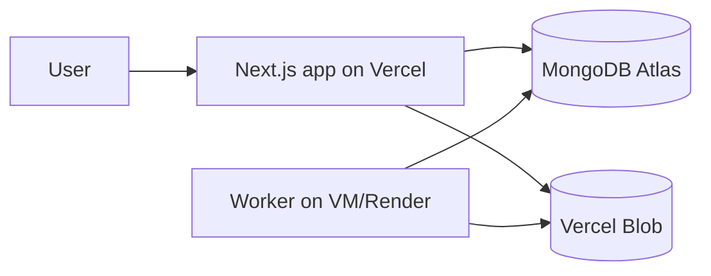

# AutoDemo AI

An internal AI-powered platform that automatically generates SaaS product demonstration videos from live applications.

You provide an application URL, login credentials, and a description of what to demonstrate. AutoDemo logs in, explores the app, proposes a demo workflow for your approval, then records it, writes narration, generates a voiceover, and produces platform-specific videos with captions and thumbnails — all downloadable.

> Internal tool only. No multi-tenancy, billing, organizations, or roles. Single admin login.

---

## Architecture

Two processes share one repository and one database:

| Process | Runs on | Responsibilities |
| --- | --- | --- |
| **Next.js app** | Vercel (or any Node host) | UI, internal auth, project CRUD, workflow editing/approval, asset browsing, job enqueue. Status via polling. |
| **Standalone worker** | A long-running Node host (VM / Render / Railway / Fly) | Polls the Mongo `jobs` queue and runs the heavy pipeline: Playwright discovery + recording, OpenAI workflow/script, voice synthesis, Remotion render, FFmpeg export, captions, thumbnails. |

Heavy native dependencies (Playwright, Remotion renderer, FFmpeg) are **only** used by the worker, never bundled into Next.js serverless functions.

### Pipeline state machine

```
discover job:  queued -> discovering -> building_workflow -> awaiting_approval
produce job:   queued -> recording -> generating_script -> generating_audio -> rendering -> exporting -> completed
(any failure -> failed)
```

### Graceful degradation

Every external integration (OpenAI, ElevenLabs, the target app login, Vercel Blob, FFmpeg) is optional. When something is missing, the pipeline logs `MISSING: <name>`, swaps in a deterministic mock (placeholder screenshots, templated workflow/script, silent audio, Remotion-based export), and continues. On completion the job records a `missingCredentials` list so the UI shows exactly what ran in mock mode.

---

## Folder structure

```
.
├── app/
│   ├── (app)/                     # Authenticated shell (sidebar + topbar)
│   │   ├── dashboard/             # Projects table
│   │   ├── projects/
│   │   │   ├── new/               # Create project form
│   │   │   └── [id]/              # Project detail
│   │   │       ├── workflow/      # Drag-and-drop workflow editor
│   │   │       └── assets/        # Asset library
│   │   └── settings/              # Integration/env status
│   ├── api/
│   │   ├── auth/                  # Login / logout
│   │   ├── projects/              # CRUD
│   │   ├── jobs/                  # Job status (polling)
│   │   ├── generate/              # Enqueue discover/produce jobs
│   │   ├── workflows/             # Save / approve / regenerate
│   │   ├── assets/                # List + download
│   │   └── storage/[...key]/      # Local file serving (dev)
│   ├── login/                     # Public login page
│   ├── layout.tsx, error.tsx, global-error.tsx, not-found.tsx
│   └── globals.css
├── components/
│   ├── ui/                        # shadcn/ui primitives
│   ├── layout/                    # Sidebar, Topbar, ThemeToggle, AppShell
│   ├── forms/                     # Login + Create Project forms
│   ├── projects/                  # ProjectsTable, ProjectInfo, GenerationPanel
│   ├── workflow/                  # WorkflowEditor, WorkflowSummary
│   ├── assets/                    # AssetLibrary
│   └── status/                    # StatusBadge, JobProgress, JobLogs, MissingCredentials
├── lib/
│   ├── db/                        # Data layer (Mongoose + file backends)
│   ├── auth/                      # Session cookie + constants
│   ├── openai/                    # client, workflow, script
│   ├── playwright/                # discovery, recording
│   ├── remotion/                  # Composition (Root, DemoVideo, entry)
│   ├── video/                     # render, captions, thumbnail, voice/*, media-resolve
│   ├── ffmpeg/                    # Platform export
│   ├── workflow/                  # context (reporter) + orchestrator
│   ├── storage/                   # local + Vercel Blob abstraction
│   ├── validation/                # Zod schemas
│   ├── media/                     # SVG placeholder generators
│   ├── crypto.ts, env.ts, logger.ts, mongodb.ts, serialize.ts, utils.ts, api-client.ts
├── models/                        # Mongoose schemas: Project, VideoAsset, Job
├── types/                         # Shared domain types
├── hooks/                         # use-polling, use-projects, use-job, use-assets
├── store/                         # Zustand UI store
├── worker/                        # Standalone worker (index bootstrap + loop)
├── middleware.ts                  # Auth gate
└── .env.example
```

---

## 1. Installation

Requirements:

- **Node.js 20+** (developed on Node 24)
- **MongoDB Atlas** connection string (optional for local dev — see below)
- **FFmpeg** on `PATH` (optional — the worker falls back to Remotion for exports if absent)

```bash
# Install dependencies
npm install

# Install the Playwright Chromium browser (required by the worker for real
# discovery/recording; without it the worker uses mock screenshots)
npx playwright install chromium
```

Remotion downloads its own headless Chromium shell automatically on first render.

---

## 2. Environment variable setup

Copy `.env.example` to `.env` and fill in what you have:

```bash
cp .env.example .env
```

| Variable | Required | Purpose |
| --- | --- | --- |
| `MONGODB_URI` | Recommended | MongoDB Atlas connection string. If omitted, a local file datastore at `./storage/db` is used (single-machine dev only). |
| `OPENAI_API_KEY` | Optional | Enables real workflow generation, scripts, and TTS. Mocked if absent. |
| `OPENAI_MODEL` | Optional | Defaults to `gpt-5.5`. |
| `ADMIN_PASSWORD` | **Production** | The single admin login password. Dev default: `autodemo`. |
| `AUTH_SECRET` | **Production** | Signs the session cookie. Use a long random string. |
| `ENCRYPTION_KEY` | **Production** | Encrypts stored target-app passwords (AES-256-GCM). |
| `ELEVENLABS_API_KEY` | Optional | Only used by the ElevenLabs voice option. |
| `BLOB_READ_WRITE_TOKEN` | If `STORAGE_DRIVER=blob` | Vercel Blob token. |
| `STORAGE_DRIVER` | Optional | `local` (default) or `blob`. |
| `WORKER_POLL_INTERVAL` | Optional | Worker poll interval in ms (default `3000`). |
| `APP_BASE_URL` | Optional | Public app URL (default `http://localhost:3000`). |

The **Settings** page in the app shows which integrations are configured (booleans only — values are never displayed).

---

## 3. Local development

Run the app and the worker in two terminals (they share `.env` and the database):

```bash
# Terminal 1 — Next.js app
npm run dev          # http://localhost:3000

# Terminal 2 — pipeline worker
npm run worker       # polls the job queue and runs the pipeline
```

Then:

1. Sign in with `ADMIN_PASSWORD` (or `autodemo` if unset).
2. Create a project (URL, login, description, platforms, voice).
3. Click **Generate** / **Start discovery**. The worker discovers the app and proposes a workflow.
4. Open the **Workflow** editor, reorder/enable/rename steps, then **Approve & start recording**.
5. Watch live status, then open **Assets** to preview and download videos, audio, scripts, captions, and thumbnails.

> Without `MONGODB_URI`, the app and worker share state through `./storage/db`. This only works when both run on the same machine. Use MongoDB Atlas for anything beyond local dev.

Useful scripts:

```bash
npm run typecheck    # tsc --noEmit
npm run build        # next build
npm run worker:dev   # worker with file watching
```

---

## 4. Render worker deployment

The worker is a plain Node process: `npm run worker` (which runs `tsx worker/index.ts`). Deploy it anywhere that allows long-running processes with enough CPU/RAM for headless Chromium and video rendering. It is **not** a Vercel serverless function.

### Example: Render.com (Background Worker)

Render's native Node builder does **not** allow root, so `npx playwright install --with-deps` fails with `su: Authentication failure`. Use the repo's **Dockerfile** instead — it is based on Microsoft's official Playwright image, which includes Chromium and all required OS libraries.

1. New → **Background Worker**, connect this repo.
2. Set **Environment** to **Docker** (not Node).
3. Leave **Build command** and **Start command** empty — the [`Dockerfile`](Dockerfile) handles both.
4. Add the same environment variables as the app (`MONGODB_URI`, `OPENAI_API_KEY`, `ENCRYPTION_KEY`, `STORAGE_DRIVER=blob`, `BLOB_READ_WRITE_TOKEN`, `NODE_ENV=production`, etc.).
5. Recommended instance: **Standard (2 GB RAM)** or higher for headless Chromium + video rendering. Starter (512 MB) may OOM on heavy jobs.

> You do not need Docker installed locally. Render builds the container from the Dockerfile when you push to GitHub. After the first deploy with Docker, trigger a manual redeploy if Render still shows the old Node build settings.

### Example: a VM (Ubuntu)

```bash
sudo apt-get update && sudo apt-get install -y ffmpeg
git clone <repo> && cd Site
npm install
npx playwright install --with-deps chromium
# create .env with production values (MONGODB_URI, ENCRYPTION_KEY, STORAGE_DRIVER=blob, BLOB token...)
npm run worker        # run under pm2/systemd for resilience
```

Run it under a process manager, e.g. pm2:

```bash
npm i -g pm2
pm2 start "npm run worker" --name autodemo-worker
pm2 save
```

> In production, set `STORAGE_DRIVER=blob` so both the app and worker read/write the same Vercel Blob store. With `local` storage the worker writes to its own disk, which the Vercel app cannot read.

---

## 5. Vercel deployment (the app)

1. Push the repo to GitHub and import it into Vercel.
2. Framework preset: **Next.js** (auto-detected).
3. Add environment variables in the Vercel project settings:
   - `MONGODB_URI`, `OPENAI_API_KEY`, `OPENAI_MODEL`
   - `ADMIN_PASSWORD`, `AUTH_SECRET`, `ENCRYPTION_KEY`
   - `STORAGE_DRIVER=blob`, `BLOB_READ_WRITE_TOKEN`
   - `APP_BASE_URL=https://your-app.vercel.app`
4. Create a Vercel Blob store (Storage → Blob) — this provisions `BLOB_READ_WRITE_TOKEN`.
5. Deploy.

The worker is **not** deployed to Vercel; deploy it separately (section 4) pointing at the **same** `MONGODB_URI` and Blob store.



---

## 6. Production readiness checklist

- [ ] `MONGODB_URI` points at a production MongoDB Atlas cluster (IP access list includes the app + worker).
- [ ] `ADMIN_PASSWORD` set to a strong value (not the `autodemo` default).
- [ ] `AUTH_SECRET` set to a long random string.
- [ ] `ENCRYPTION_KEY` set to a strong random value (rotating it invalidates stored passwords).
- [ ] `STORAGE_DRIVER=blob` and `BLOB_READ_WRITE_TOKEN` set for **both** app and worker.
- [ ] `OPENAI_API_KEY` set (otherwise workflows/scripts/voiceovers are mocked).
- [ ] Worker host has Playwright/Chromium available (Dockerfile on Render, or `npx playwright install --with-deps chromium` on a VM), and FFmpeg installed (or accepts the Remotion fallback).
- [ ] Worker runs under a process manager (pm2/systemd) or a managed background-worker service.
- [ ] `APP_BASE_URL` set to the public URL.
- [ ] HTTPS enabled (the session cookie is `Secure` in production).
- [ ] Worker instance sized for headless Chromium + rendering (2 GB+ RAM recommended).
- [ ] Confirm a full run completes end-to-end and the job's `missingCredentials` list is empty.

---

## Tech stack

Next.js 15 (App Router) · TypeScript · Tailwind CSS · shadcn/ui · Zustand · Mongoose / MongoDB Atlas · OpenAI · Playwright · Remotion · FFmpeg · Vercel Blob · Zod · React Hook Form.
